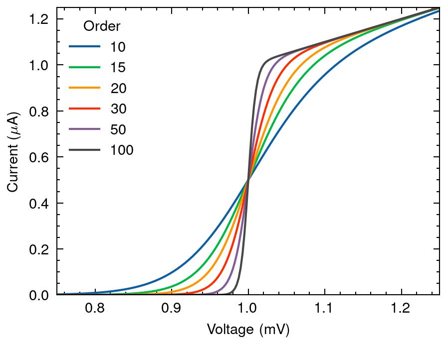
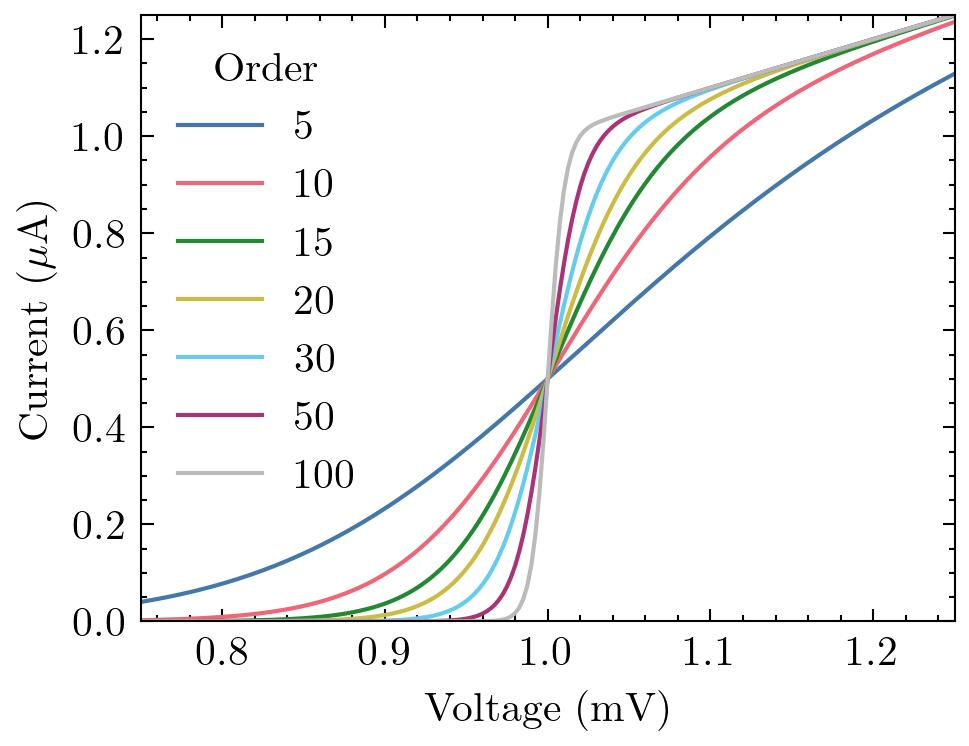
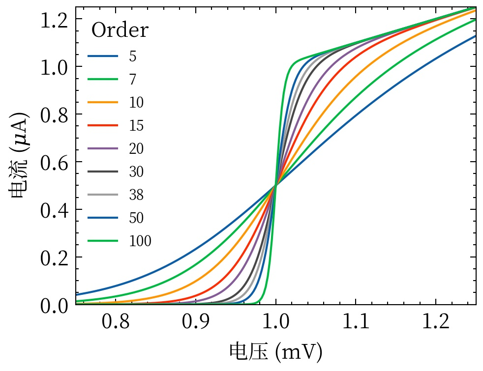

# GitHub 科研绘图方案调研

本页记录 MathModelAgent 图表质量层参考的开源项目。原则是学习成熟模式，不把每个项目都安装成运行时依赖。

## 视觉样例

### SciencePlots

Nature 样式：

色盲安全 bright 样式：

简体中文：

判断：字体、尺寸、线宽和导出很稳定，但单独使用时偏传统、偏朴素。适合作为底座，不适合作为图形叙事系统。

### cnsplots

[GitHub](https://github.com/faridrashidi/cnsplots) · [官方总览图](https://raw.githubusercontent.com/faridrashidi/cnsplots/main/docs/_static/images/overview.png) · BSD-3-Clause

25+ 图型、多面板、统计标记、Nature/Cell/Science 配色和 Illustrator 可编辑 SVG 都很成熟。视觉上比 SciencePlots 丰富，但运行时包含 `scanpy`、`lifelines`、`gseapy` 等领域依赖，当前工作流只需要其中很小一部分，因此不整体安装。借鉴其多面板编排、panel label、直接统计标注和最终像素尺寸意识。

### matplotlib-skill

[GitHub](https://github.com/tvhahn/matplotlib-skill) · MIT

最值得直接吸收的是设计原则和 pattern，而不是代码：

1. 先写清读者应该看出的结论，再选图型。
2. 每个视觉元素都必须有信息用途。
3. 优先位置编码，其次颜色，再其次大小。
4. 灰色和留白用于建立层级，不把每条线都画成强调色。
5. 先去边框和网格，再只加回读数需要的部分。
6. 标注洞察，不只是标注坐标轴。
7. 重要类别必须颜色 + 线型/marker 双重编码。
8. 同一多面板内部保持尺度、颜色和术语一致。
9. 能直接标数值或差值时，不让读者心算。
10. 不确定时删除。

其 9 个 pattern 覆盖横/纵柱状图、时间序列、violin+strip、lollipop、决策边界、热图、多面板和 PR/ROC。当前 overlay 应吸收 pattern 的选择规则和视觉复查步骤，不复制其固定个人配色。

### AgentFigureGallery

[GitHub](https://github.com/Dsadd4/AgentFigureGallery) · [Plot-type smoke preview](https://raw.githubusercontent.com/Dsadd4/AgentFigureGallery/main/examples/plot_type_examples/figures/agentfiguregallery_plot_type_examples_preview.png) · MIT

核心思想是 `agent query → reference gallery → like/reject/select → reference bundle → plotting code`。完整公共库有 16k+ 视觉候选，适合人在回路的风格选择。当前 MathModelAgent 要求自动运行，因此暂不引入浏览器选择服务；后续可以只取小型 curated reference pack，并将 Planner 的 plot family 用作查询条件。

### PyThesisPlot

[GitHub](https://github.com/stephenlzc/pythesis-plot) · MIT

优点是 Data → Analysis → Recommendations → Confirmation → Figures 的流程，以及 line/bar/box/scatter/heatmap/dashboard 基础覆盖。它要求用户确认图型，与当前全自动工作流冲突；借鉴 recommendation 阶段，但由 Planner + Scientific Reviewer 取代人工确认。

### PubPlotLib

[GitHub](https://github.com/pier-astro/PubPlotLib) · MIT

擅长期刊单栏/双栏/整页毫米尺寸、ticks 和 formatter。对天文期刊很实用，但与 SciencePlots 的尺寸职责重叠，而且不解决图形叙事。当前不新增依赖，只吸收“按最终论文栏宽审图”的原则。

### FigRecipe

[GitHub](https://github.com/ywatanabe1989/figrecipe) · AGPL-3.0

优点是图、YAML recipe 和每条 trace 的 CSV 同时保存，并支持复现、GUI 编辑、组合和验证。当前 Host 已通过 `verification.json.figures`、生成脚本、真实数据路径和 SHA-256 freezing 实现类似谱系；引入 AGPL wrapper 会重复架构，因此不采用。

### anyplot

[GitHub](https://github.com/MarkusNeusinger/anyplot) · MIT

规范优先、跨 15 个绘图库生成，并用 AI quality threshold 审图。它需要 Python 3.13、服务端和 MCP，超出本地 MathModelAgent 范围。借鉴“先写 library-agnostic plot specification，再生成实现”。

## 采用策略

保留当前轻量运行时：

- SciencePlots：出版底座；
- Seaborn/Matplotlib：绘制；
- adjustText：必要标签避让；
- 现有 11 套专题模板：命中科学目的时适配真实数据；
- `verification.json.figures`：数据和生成谱系；
- Scientific Review + Document Verification：语义和最终尺寸视觉验收。

新增的不是另一套绘图库，而是成熟 pattern。运行时使用的 31 项本地参考目录位于 [`pi/skills/mathmodel-figure-quality/references/figure-reference-catalog.json`](../../pi/skills/mathmodel-figure-quality/references/figure-reference-catalog.json)，所有条目均显式标为 `evidence_eligible=false`：

- 排名图：排序、直接数值、单一强调色；
- 分布图：密度/箱线 + 原始点 + 中位数；
- 时间/收敛图：原始轨迹 + 趋势/阈值 + 起止变化；
- 模型性能：fold/样本为浅灰，主结果为深色，基线为虚线；
- 多面板：只组合共享决策语境的量，统一尺度和 regime 编码；
- 每张图最多 3 轮视觉检查，第三轮后仍有缺陷则明确失败。

## 不采用

- 不安装 cnsplots 的完整生物信息学依赖栈；
- 不安装 FigRecipe 并替换 Matplotlib API；
- 不接 anyplot 服务或 MCP；
- 不下载 AgentFigureGallery 的 16k+ 全量图片；
- 不把 Nature/Cell 风格理解成越复杂越好；
- 不复用任何仓库的模拟数值作为论文证据。
